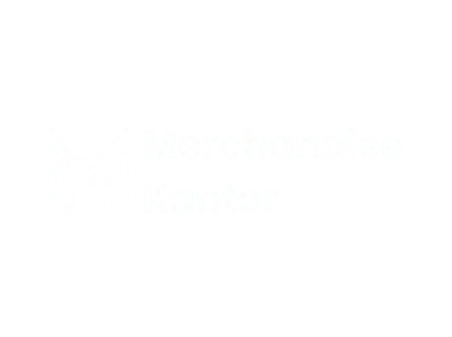
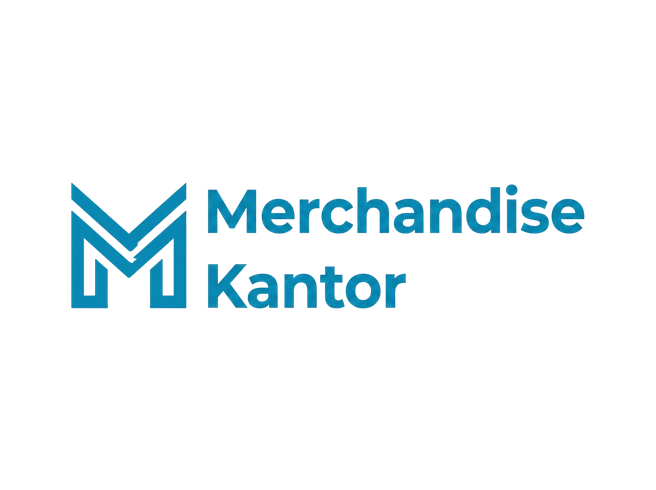
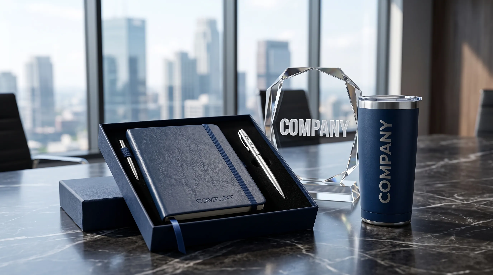
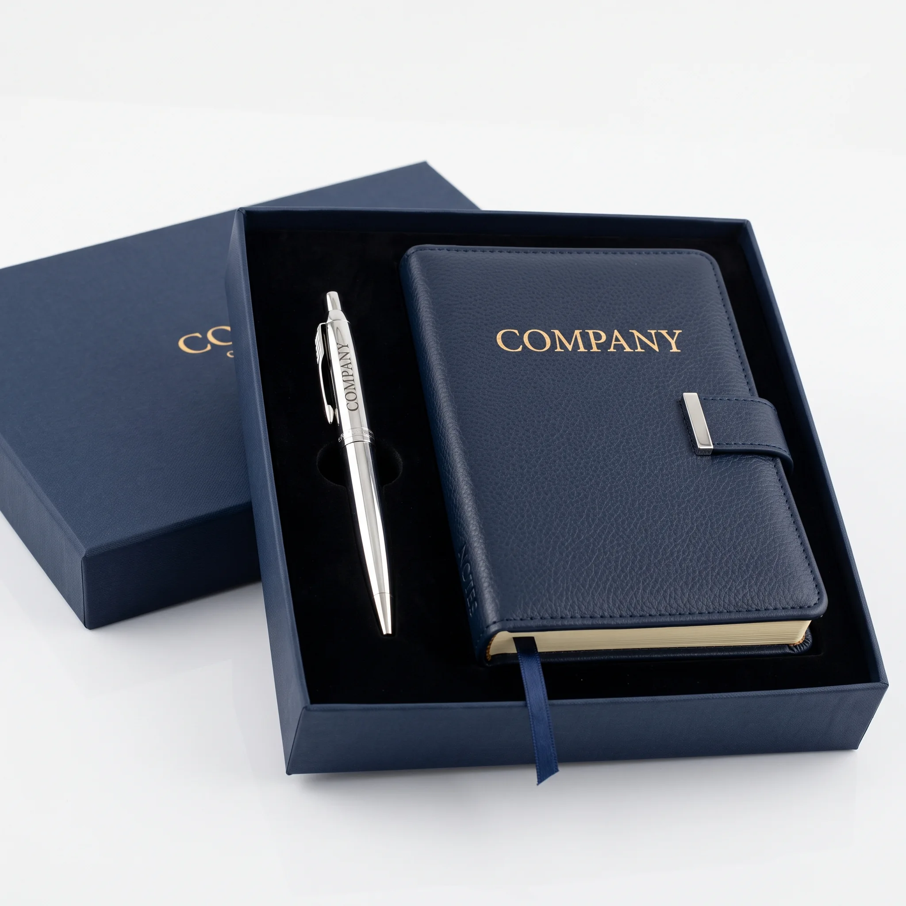
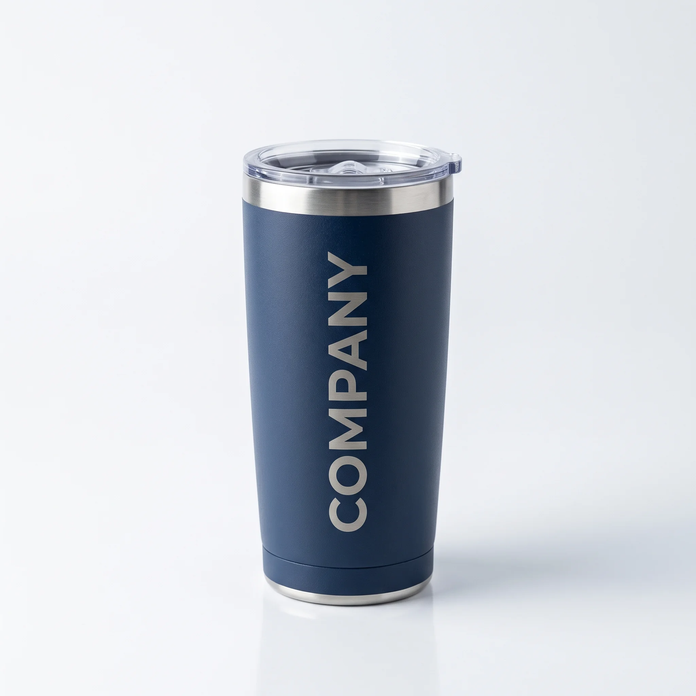
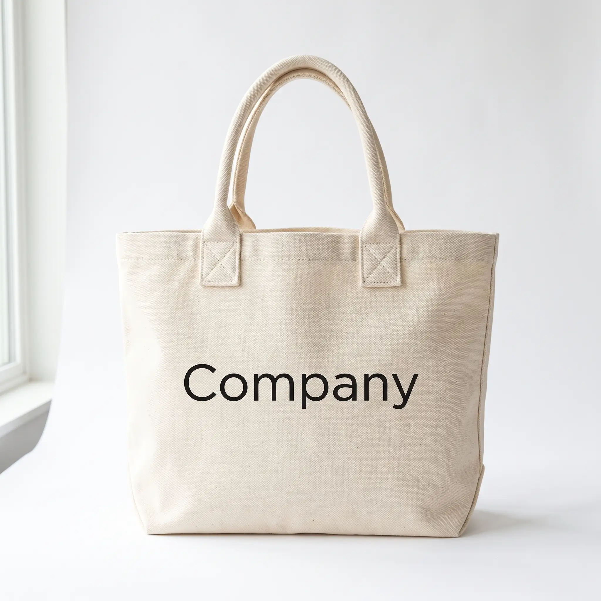

# Standard Guidelines for Creating Blog Articles (Merchandise Kantor)

Setiap pembuatan atau pembaruan artikel blog baru di proyek **Merchandise Kantor** (`vendormerchandise`) WAJIB mengikuti aturan dan struktur HTML di bawah ini agar desain, CSS, JavaScript, dan SEO konsisten 100% dan tidak mengalami kerusakan tampilan.

---

## 1. Aturan CSS & Assets Wajib

Halaman artikel **TIDAK BOLEH** menggunakan template standalone baru atau CSS eksternal lain. Selalu sertakan link CSS dan Font berikut di `<head>`:

```html
<link href="https://fonts.googleapis.com" rel="preconnect">
<link href="https://fonts.gstatic.com" rel="preconnect" crossorigin>
<link href="https://fonts.googleapis.com/css2?family=Roboto:ital,wght@0,100;0,300;0,400;0,500;0,700;0,900;1,100;1,300;1,400;1,500;1,700;1,900&family=Poppins:ital,wght@0,100;0,200;0,300;0,400;0,500;0,600;0,700;0,800;0,900;1,100;1,200;1,300;1,400;1,500;1,600;1,700;1,800;1,900&family=Raleway:ital,wght@0,100;0,200;0,300;0,400;0,500;0,600;0,700;0,800;0,900;1,100;1,200;1,300;1,400;1,500;1,600;1,700;1,800;1,900&display=swap" rel="stylesheet">

<link href="assets/vendor/bootstrap/css/bootstrap.min.css" rel="stylesheet">
<link href="assets/vendor/bootstrap-icons/bootstrap-icons.css" rel="stylesheet">
<link href="assets/vendor/aos/aos.css" rel="stylesheet">
<link href="assets/css/main.css?v=2" rel="stylesheet">
```

---

## 2. Struktur Skeleton Wajib Halaman Artikel

```html
<!DOCTYPE html>
<html lang="id">

<head>
    <meta charset="utf-8">
    <meta content="width=device-width, initial-scale=1.0" name="viewport">
    <meta name="theme-color" content="#0d6efd">
    <meta http-equiv="Content-Language" content="id">

    <link href="assets/img/favicon-logo.webp" rel="icon" type="image/webp">
    <link href="assets/img/apple-touch-icon.png" rel="apple-touch-icon">

    <title>[Meta Title] | Merchandise Kantor</title>
    <meta name="description" content="[Meta Description]">
    <meta name="keywords" content="[Focus Keyphrase, Secondary Entities]">
    <meta name="author" content="Erlang Sinatrya">
    <meta name="robots" content="index, follow, max-image-preview:large, max-snippet:-1, max-video-preview:-1">
    <meta name="googlebot" content="index, follow">
    <link rel="canonical" href="https://vendormerchandise.web.id/[slug].html">

    <!-- Open Graph & Twitter -->
    <meta property="og:locale" content="id_ID">
    <meta property="og:type" content="article">
    <meta property="og:title" content="[Meta Title]">
    <meta property="og:description" content="[Meta Description]">
    <meta property="og:url" content="https://vendormerchandise.web.id/[slug].html">
    <meta property="og:site_name" content="Merchandise Kantor">
    <meta property="og:image" content="https://vendormerchandise.web.id/assets/img/blog/[featured-img].webp">
    <meta property="og:image:width" content="1200">
    <meta property="og:image:height" content="630">
    <meta property="article:published_time" content="2026-09-XXT08:00:00+07:00">
    <meta property="article:modified_time" content="2026-09-XXT08:00:00+07:00">
    <meta property="article:author" content="Erlang Sinatrya">
    <meta property="article:section" content="Layanan B2B">

    <meta name="twitter:card" content="summary_large_image">
    <meta name="twitter:title" content="[Meta Title]">
    <meta name="twitter:description" content="[Meta Description]">
    <meta name="twitter:image" content="https://vendormerchandise.web.id/assets/img/blog/[featured-img].webp">

    <!-- JSON-LD Schemas -->
    <script type="application/ld+json">
    {
      "@context": "https://schema.org",
      "@graph": [
        {
          "@type": "Organization",
          "@id": "https://vendormerchandise.web.id/#organization",
          "name": "Merchandise Kantor",
          "url": "https://vendormerchandise.web.id/",
          "logo": {
            "@type": "ImageObject",
            "url": "https://vendormerchandise.web.id/assets/img/travel/logotr-blue.webp"
          }
        },
        {
          "@type": "Person",
          "@id": "https://vendormerchandise.web.id/#/schema/person/erlang-sinatrya",
          "name": "Erlang Sinatrya",
          "url": "https://vendormerchandise.web.id/",
          "jobTitle": "Penulis Merchandise Kantor",
          "worksFor": { "@id": "https://vendormerchandise.web.id/#organization" }
        },
        {
          "@type": "Article",
          "@id": "https://vendormerchandise.web.id/[slug].html#article",
          "headline": "[Meta Title]",
          "description": "[Meta Description]",
          "url": "https://vendormerchandise.web.id/[slug].html",
          "datePublished": "2026-09-XXT08:00:00+07:00",
          "dateModified": "2026-09-XXT08:00:00+07:00",
          "author": { "@id": "https://vendormerchandise.web.id/#/schema/person/erlang-sinatrya" },
          "publisher": { "@id": "https://vendormerchandise.web.id/#organization" },
          "image": {
            "@type": "ImageObject",
            "url": "https://vendormerchandise.web.id/assets/img/blog/[featured-img].webp"
          }
        },
        {
          "@type": "BreadcrumbList",
          "@id": "https://vendormerchandise.web.id/[slug].html#breadcrumb",
          "itemListElement": [
            { "@type": "ListItem", "position": 1, "name": "Beranda", "item": "https://vendormerchandise.web.id/" },
            { "@type": "ListItem", "position": 2, "name": "Artikel", "item": "https://vendormerchandise.web.id/blog.html" },
            { "@type": "ListItem", "position": 3, "name": "[Judul Artikel]", "item": "https://vendormerchandise.web.id/[slug].html" }
          ]
        },
        {
          "@type": "FAQPage",
          "@id": "https://vendormerchandise.web.id/[slug].html#faq",
          "mainEntity": [...]
        }
      ]
    }
    </script>

    <link href="assets/vendor/bootstrap/css/bootstrap.min.css" rel="stylesheet">
    <link href="assets/vendor/bootstrap-icons/bootstrap-icons.css" rel="stylesheet">
    <link href="assets/vendor/aos/aos.css" rel="stylesheet">
    <link href="assets/css/main.css?v=2" rel="stylesheet">

    <style>
        #scroll-top { bottom: 90px !important; right: 27px !important; }
        .whatsapp-float {
            position: fixed; width: 60px; height: 60px; bottom: 20px; right: 20px;
            background-color: #25D366; color: #fff; border-radius: 50%; font-size: 30px;
            box-shadow: 0 4px 15px rgba(0, 0, 0, 0.3); z-index: 999;
            display: flex; align-items: center; justify-content: center; text-decoration: none;
            transition: all 0.3s ease; animation: pulse 2s infinite;
        }
        .whatsapp-float:hover { background-color: #128C7E; transform: scale(1.1); }
        @keyframes pulse {
            0% { box-shadow: 0 0 0 0 rgba(37, 211, 102, 0.6); }
            70% { box-shadow: 0 0 0 15px rgba(37, 211, 102, 0); }
            100% { box-shadow: 0 0 0 0 rgba(37, 211, 102, 0); }
        }
    </style>
</head>

<body class="blog-details-page">

    <header id="header" class="header d-flex align-items-center fixed-top">
        <div class="header-container container-fluid position-relative d-flex align-items-center justify-content-between">
            <a href="/" class="logo d-flex align-items-center">
                
                
            </a>
            <nav id="navmenu" class="navmenu">
                <ul>
                    <li><a href="/">Beranda</a></li>
                    <li><a href="about.html">Tentang Kami</a></li>
                    <li><a href="produk.html">Produk</a></li>
                    <li><a href="blog.html" class="active">Blog</a></li>
                    <li><a href="gallery.html">Galeri</a></li>
                    <li><a href="contact.html">Kontak</a></li>
                </ul>
                <i class="mobile-nav-toggle d-xl-none bi bi-list"></i>
            </nav>
        </div>
    </header>

    <main class="main">

        <div class="breadcrumb-bar">
            <div class="container">
                <a href="/">Beranda</a><span class="separator">/</span>
                <a href="blog.html">Artikel</a><span class="separator">/</span>
                <span>[Judul Artikel]</span>
            </div>
        </div>

        <section class="section pt-5">
            <div class="container">
                <div class="article-layout">

                    <!-- MAIN CONTENT -->
                    <div class="article-main">

                        <h1 class="article-title" data-aos="fade-up">[Judul Artikel]</h1>

                        <div class="article-top-meta" data-aos="fade-up" data-aos-delay="100">
                            <div class="meta-author">
                                
                                <span>Erlang Sinatrya</span>
                            </div>
                            <span><i class="bi bi-calendar4-week"></i> [Tanggal Artikel]</span>
                            <span><i class="bi bi-clock"></i> 5 menit baca</span>
                        </div>

                        <div class="featured-image-wrap" data-aos="zoom-in">
                            
                            <div class="featured-caption">[Alt Featured]</div>
                        </div>

                        <div class="summary-box" data-aos="fade-up">
                            <h3>Ringkasan Inti</h3>
                            <p><strong>Jawaban Singkat:</strong> [Jawaban singkat dari artikel]</p>
                            <ul>
                                <li>[Poin ringkasan 1]</li>
                                <li>[Poin ringkasan 2]</li>
                                <li>[Poin ringkasan 3]</li>
                                <li>[Poin ringkasan 4]</li>
                                <li>[Poin ringkasan 5]</li>
                            </ul>
                        </div>

                        <div class="toc-box">
                            <button class="toc-toggle" onclick="this.classList.toggle('active'); this.nextElementSibling.classList.toggle('show')">
                                Daftar Isi <i class="bi bi-chevron-right"></i>
                            </button>
                            <div class="toc-content">
                                <ul id="auto-toc-list"></ul>
                            </div>
                        </div>

                        <div class="article-body">
                            <!-- Paragraf Pembuka -->

                            <h2 id="[id-h2-1]">[Judul H2 1]</h2>
                            <p>...</p>

                            <div class="baca-juga-box">
                                <i class="bi bi-bookmark-star"></i>
                                <span class="label">Baca Juga:</span>
                                <a href="[artikel-terkait-1].html">[Judul Artikel Terkait 1]</a>
                            </div>

                            <h2 id="[id-h2-2]">[Judul H2 2]</h2>
                            <p>...</p>

                            <figure class="body-figure" data-aos="fade-up">
                                
                                <figcaption>[Alt Body Img]</figcaption>
                            </figure>

                            <div class="baca-juga-box">
                                <i class="bi bi-bookmark-star"></i>
                                <span class="label">Baca Juga:</span>
                                <a href="[artikel-terkait-2].html">[Judul Artikel Terkait 2]</a>
                            </div>

                            <h2 id="[id-h2-3]">[Judul H2 3]</h2>
                            <p>...</p>

                            <h2 id="[id-h2-4]">[Judul H2 4]</h2>
                            <p>...</p>

                            <!-- Internal link kontekstual -->
                            <p>...</p>

                            <a href="https://wa.me/6288989643555" target="_blank" class="promo-banner" data-aos="fade-up">
                                
                                <div class="promo-overlay">
                                    <span class="promo-text">[CTA Text]</span>
                                    <span class="promo-cta"><i class="bi bi-whatsapp"></i> Konsultasi Gratis via WhatsApp</span>
                                </div>
                            </a>

                            <h2 id="[id-h2-cta]">[Judul H2 CTA]</h2>
                            <p>[Paragraf CTA]</p>
                        </div>

                        <div class="article-faq" data-aos="fade-up">
                            <h3>Pertanyaan Seputar [Topik]</h3>
                            <div class="faq-mini-item">
                                <button class="faq-mini-question">
                                    [Pertanyaan 1]?
                                    <i class="bi bi-plus-lg"></i>
                                </button>
                                <div class="faq-mini-answer">
                                    <p>[Jawaban 1]</p>
                                </div>
                            </div>
                            <!-- More FAQ mini items -->
                        </div>

                        <div class="share-article-box" data-aos="fade-up">
                            <h4>Bagikan Artikel Ini</h4>
                            <div class="share-buttons-row">
                                <a href="#" target="_blank" class="share-btn whatsapp" data-share="whatsapp"><i class="bi bi-whatsapp"></i> WhatsApp</a>
                                <a href="#" target="_blank" class="share-btn facebook" data-share="facebook"><i class="bi bi-facebook"></i> Facebook</a>
                                <a href="#" target="_blank" class="share-btn twitter" data-share="twitter"><i class="bi bi-twitter-x"></i> Twitter</a>
                                <a href="#" target="_blank" class="share-btn linkedin" data-share="linkedin"><i class="bi bi-linkedin"></i> LinkedIn</a>
                            </div>
                        </div>

                        <div class="article-tags-footer">
                            <a href="blog.html" class="tag-pill">[Tag 1]</a>
                            <a href="blog.html" class="tag-pill">[Tag 2]</a>
                            <a href="blog.html" class="tag-pill">Merchandise Kantor</a>
                        </div>

                    </div>

                    <!-- SIDEBAR -->
                    <aside class="article-sidebar">
                        <div class="sidebar-author-card" data-aos="fade-left">
                            
                            <h4>Erlang Sinatrya</h4>
                            <div class="sidebar-social">
                                <a href="#"><i class="bi bi-instagram"></i></a>
                                <a href="#"><i class="bi bi-linkedin"></i></a>
                                <a href="#"><i class="bi bi-twitter-x"></i></a>
                            </div>
                            <p class="desc">Erlang Sinatrya (lang) adalah Penulis di Merchandise Kantor yang fokus membahas merchandise branding, promosi, dan corporate gift untuk kebutuhan bisnis perusahaan.</p>
                        </div>

                        <div class="sidebar-related" data-aos="fade-left" data-aos-delay="100">
                            <h4>Artikel Terkait dari Erlang Sinatrya</h4>
                            <!-- 3 Sidebar related article links with img, title, & date -->
                        </div>
                    </aside>

                </div>
            </div>
        </section>

        <!-- Rekomendasi Produk -->
        <section class="related-articles-section" data-aos="fade-up">
            <div class="container">
                <h3 class="related-heading">Rekomendasi Produk Merchandise Pilihan</h3>
                <div class="related-grid">
                    <article class="related-card">
                        <a href="produk.html"></a>
                        <div class="related-card-content">
                            <h4><a href="produk.html">Paket Executive Gift Box &amp; Hampers</a></h4>
                            <p>Set merchandise eksklusif berisi notebook leather, pulpen premium, dan tumbler custom logo untuk klien &amp; partner bisnis.</p>
                            <a href="produk.html" class="related-read-more">Lihat Produk <i class="bi bi-arrow-right"></i></a>
                        </div>
                    </article>
                    <article class="related-card">
                        <a href="produk.html"></a>
                        <div class="related-card-content">
                            <h4><a href="produk.html">Tumbler Stainless &amp; Drinkware Custom</a></h4>
                            <p>Pilihan tumbler tahan panas dan dingin dengan grafir laser logo presisi, cocok untuk hadiah korporat harian.</p>
                            <a href="produk.html" class="related-read-more">Lihat Produk <i class="bi bi-arrow-right"></i></a>
                        </div>
                    </article>
                    <article class="related-card">
                        <a href="produk.html"></a>
                        <div class="related-card-content">
                            <h4><a href="produk.html">Tas Kerja &amp; Tote Bag Custom</a></h4>
                            <p>Tote bag kanvas, tas laptop, dan organizer seminar berkualitas tinggi untuk memperkuat branding perusahaan.</p>
                            <a href="produk.html" class="related-read-more">Lihat Produk <i class="bi bi-arrow-right"></i></a>
                        </div>
                    </article>
                </div>
            </div>
        </section>

        <!-- CTA Section -->
        <section class="cta-section py-5 light-background">
            <div class="container text-center" data-aos="fade-up">
                <h2>Butuh Bantuan [Topik Artikel]?</h2>
                <p class="text-secondary mb-4">Konsultasikan kebutuhan merchandise dan permohonan penawaran resmi perusahaan Anda bersama kami sekarang.</p>
                <a href="https://wa.me/6288989643555" target="_blank" class="btn btn-primary"><i class="bi bi-whatsapp"></i> Konsultasi via WhatsApp</a>
            </div>
        </section>

    </main>

    <footer id="footer" class="footer position-relative dark-background">
        <div class="container footer-top">
            <div class="row gy-4">
                <div class="col-lg-4 col-md-6 footer-about">
                    <a href="/" class="d-flex align-items-center"><span class="sitename">Merchandise Kantor</span></a>
                    <div class="footer-contact pt-3">
                        <p>Pusat souvenir kantor dan merchandise kantor. Menyediakan berbagai pilihan produk custom untuk kebutuhan promosi, seminar, dan hadiah kantor.</p>
                    </div>
                </div>
                <div class="col-lg-2 col-md-3 footer-links">
                    <h4>Layanan</h4>
                    <ul>
                        <li><i class="bi bi-chevron-right"></i> <a href="merchandise-kantor-premium.html">Merchandise Premium</a></li>
                        <li><i class="bi bi-chevron-right"></i> <a href="merchandise-onboarding-karyawan.html">Onboarding Karyawan</a></li>
                        <li><i class="bi bi-chevron-right"></i> <a href="produk.html#custom">Custom Logo</a></li>
                        <li><i class="bi bi-chevron-right"></i> <a href="produk.html">Semua Produk</a></li>
                    </ul>
                </div>
                <div class="col-lg-2 col-md-3 footer-links">
                    <h4>Informasi</h4>
                    <ul>
                        <li><i class="bi bi-chevron-right"></i> <a href="/">Beranda</a></li>
                        <li><i class="bi bi-chevron-right"></i> <a href="about.html">Tentang Kami</a></li>
                        <li><i class="bi bi-chevron-right"></i> <a href="gallery.html">Galeri</a></li>
                        <li><i class="bi bi-chevron-right"></i> <a href="contact.html">Kontak</a></li>
                    </ul>
                </div>
                <div class="col-lg-4 col-md-12">
                    <h4>Ikuti Kami</h4>
                    <p>Temukan inspirasi merchandise dan update produk terbaru di sosial media kami.</p>
                    <div class="social-links d-flex">
                        <a href="" aria-label="WhatsApp" title="WhatsApp"><i class="bi bi-whatsapp"></i></a>
                        <a href="" aria-label="Instagram" title="Instagram"><i class="bi bi-instagram"></i></a>
                        <a href="" aria-label="Facebook" title="Facebook"><i class="bi bi-facebook"></i></a>
                        <a href="" aria-label="LinkedIn" title="LinkedIn"><i class="bi bi-linkedin"></i></a>
                    </div>
                </div>
            </div>
        </div>
        <div class="container copyright text-center mt-4">
            <p>© <span>Copyright</span> <strong class="px-1 sitename">Merchandise Kantor</strong> <span>All Rights Reserved</span></p>
        </div>
    </footer>

    <a href="https://wa.me/6288989643555" target="_blank" class="whatsapp-float" title="Chat via WhatsApp"><i class="bi bi-whatsapp"></i></a>
    <a href="#" id="scroll-top" class="scroll-top d-flex align-items-center justify-content-center"><i class="bi bi-arrow-up-short"></i></a>
    <div id="preloader"></div>

    <script src="assets/vendor/bootstrap/js/bootstrap.bundle.min.js"></script>
    <script src="assets/vendor/aos/aos.js"></script>
    <script src="assets/js/main.js"></script>

    <script>
        document.addEventListener('DOMContentLoaded', function () {
            const tocList = document.getElementById('auto-toc-list');
            const headings = document.querySelectorAll('.article-body h2, .article-body h3');

            headings.forEach(function (heading, index) {
                if (!heading.id) heading.id = 'section-' + index;
                const li = document.createElement('li');
                if (heading.tagName === 'H3') li.style.paddingLeft = '18px';
                const a = document.createElement('a');
                a.href = '#' + heading.id;
                a.textContent = heading.textContent;
                li.appendChild(a);
                tocList.appendChild(li);
            });

            document.querySelectorAll('.faq-mini-question').forEach(function (btn) {
                btn.addEventListener('click', function () {
                    const item = btn.closest('.faq-mini-item');
                    item.classList.toggle('active');
                });
            });

            const pageUrl = encodeURIComponent(window.location.href);
            const pageTitle = encodeURIComponent(document.title);
            const shareLinks = {
                whatsapp: 'https://wa.me/?text=' + pageTitle + '%20' + pageUrl,
                facebook: 'https://www.facebook.com/sharer/sharer.php?u=' + pageUrl,
                twitter: 'https://twitter.com/intent/tweet?url=' + pageUrl + '&text=' + pageTitle,
                linkedin: 'https://www.linkedin.com/sharing/share-offsite/?url=' + pageUrl
            };
            document.querySelectorAll('[data-share]').forEach(function (btn) {
                const type = btn.getAttribute('data-share');
                if (shareLinks[type]) btn.setAttribute('href', shareLinks[type]);
            });
        });
    </script>
</body>
</html>
```

---

## 3. Workflow Pembaruan Otomatis Setiap Tambah Artikel

1. **Buat file artikel HTML (`[slug].html`)** mengacu persis pada skema Skeleton di atas.
2. **Perbarui `blog.html`**:
   - Sisipkan kartu artikel di paling atas grid `#blog-posts .row.gy-4`.
   - Sisipkan objek ListItem baru di paling atas array `ItemList` JSON-LD schema.
   - Ubah `numberOfItems` di schema `ItemList`.
3. **Jalankan script re-index schema**: `node scratch/fix_blog_schema_positions.js`.
4. **Perbarui & Jalankan script sitemap**:
   - Tambahkan URL artikel baru di `scratch/rebuild_clean_sitemap.js` dengan tanggal `lastmod`.
   - Jalankan `node scratch/rebuild_clean_sitemap.js`.
